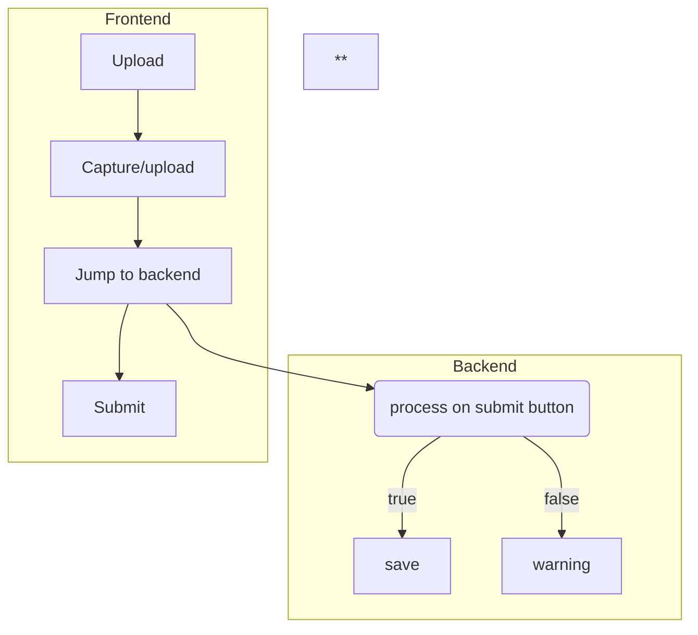

# POTHOLE DETECTION 

# *Abstract :*

 - **Poor road conditions, such as potholes, are a nuisance to society, which would annoy passengers, damage vehicles, and even cause accidents.**
 - **Thus, detecting potholes is an important step toward pavement maintenance and rehabilitation to improve road conditions.**
 - **Potholes have different shapes, scales, shadows, and illumination effects, and highly complicated backgrounds can be involved.** 
 - **Therefore, detection of potholes in road images is still a challenging task**. 

 -  **In this study, we focus on pothole detection in 2D vision and present a new method to detect potholes based on location-aware convolutional neural networks, which focuses on the discriminative regions in the road instead of the global context.**

# *Roadmap* :

# *Requirement :* 

 - **Anaconda** 
 - **Open CV**
 - **Python**
 - **Numpy**
 - **pandas**
 - **matplotlib**

# *Webapp (PWA)  Requirements :*

 1. **HTML**
 2. **CSS**
 3. **Javascript**
 4. **MariaDB**
 5. **Nodejs**

# *Installiation Guide :*

> **For Windows**:

 - **Download [Python](https://www.python.org/downloads/) from here**
 - **Download [Anaconda](https://www.anaconda.com/products/individual#windows) from here**
 - **Download [opencv](https://chrisconlan.com/installing-python-opencv-3-windows/#:~:text=%20Install%20Python%20OpenCV%203%20on%20Windows%20with,that%20OpenCV%203%20is%20installed.%20%20More%20) from here**

> **For Ubuntu**:

 - **Download [Python](https://phoenixnap.com/kb/how-to-install-python-3-ubuntu) from here**
 - **Download [Anaconda](https://linuxize.com/post/how-to-install-anaconda-on-ubuntu-20-04/) from here**
 - **Download [opencv](https://www.pyimagesearch.com/2016/10/24/ubuntu-16-04-how-to-install-opencv/) from here**
 
 
# ***Output :***

# *Flowchart :*

 - **Node-1 : Choosefile**
 - **Node-2 : Upload/capture**
 - **Subnode-1 : checking with AI Code**
 - **Choice-1 : True**
 - **Choice-2 : False**
 - **Dochoice-1 : store in DB**
 - **Dochoice-2 : Warning**
 - **Finalthing : Submit**
 

# *Sample DB :*

| Image | Adress | Latitude | Longitude |
| ------ | ------ | ------ | ------ |
| img-1 | hyderbad | 17.387140 | 78.491684 |
| img-2 | warangal | 18.000055 | 79.588165 |

# *Locatating potholes on map :*

# *Website link :* 

 **Open [webpage](http://raptors.swecha.io/pothole-detection/website/)**

